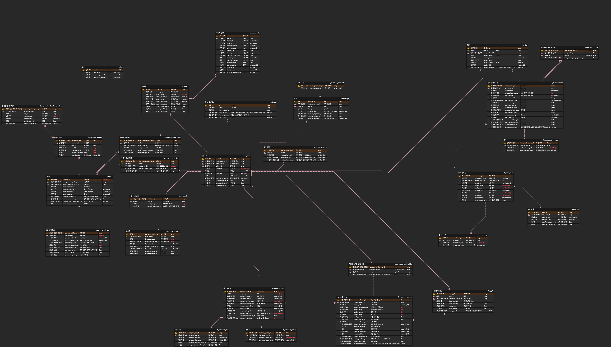

# 🥬 멋쟁이채소처럼 👩‍🌾

- 프로젝트 기한: 2023-01-13 ~ 2023-02-15 (아이디어톤, 기능구현, 문서화, 시연영상)
- 팀 구성원: FrontEnd: 2명 / BackEnd: 6명 / 인프라: 1명
- 프로젝트 일정: [WBS](https://docs.google.com/spreadsheets/d/1G3FKDs14-A7BZXuUT2Fu2Iy52dS4YALAwxrtPA3YnfI/edit?usp=sharing)
- UI 설계: [view](https://docs.google.com/presentation/d/1r4G6jzTn3J_QtFfZ5NC_oEgf0kLwH6yBJwPslcKgvz8/edit?usp=sharing)
- 함께한 팀원은 어떤 팀원이었나요?: 설문 진행(회고) - 비공개

## 📸 1. 팀 구성원

| 팀원  |       Role        |                                                                                                   구현기능                                                                                                    |
|:---:|:-----------------:|:---------------------------------------------------------------------------------------------------------------------------------------------------------------------------------------------------------:|
| 김예진 |        CTO        |                                                    - 회원 가입 및 로그인/로그아웃, Security, oauth 2.0  - 경매 / 모집 리스트 조회  - 알림 (경매 / 모집 종료시, 기업 / 농가 좋아요)                                                     |
| 김정현 |      FE / BE      |                                                           - FE (8페이지)  - 전자계약 API (이폼싸인)  - 경매/모집 마감 로직  - 경매/모집 게시글 상페페이지 조회                                                             |
| 장서윤 | 팀장 / PM / FE / BE |   - FE (17페이지)  - 프로젝트 총괄  - 결제 API (토스) 결제 및 환불(카드)  - 사용자 포인트  - 보증금 예치 서비스 (모집/경매)  - 경매 시작 최저가 게시글 5위 조회 - 마이페이지(기업/농가/공통/관리자)  - 관리자 정산(계좌이체) / 예치금 관리  - 관리자 회원가입   |
| 전수진 |      기획 / BE      |                                                                                               로고 및 발표자료 문서화                                                                                               |
| 최아영 |        BE         |                                                        - 모집 신청 및 완료  - 입찰 신청  - 문자 본인인증  - 농산물 API, 지도 API  - 기업/농가 리스트 조회 및 단건 조회                                                        |
| 서태건 |     인프라 / BE      |                                                                           - CI/CD  - 게시글 등록(기업/농가) 및 유효성  - 이미지 업로드 S3                                                                            |
| 한건주 |        BE         |                                            - 기업 회원 검증(사업자등록, 이메일, URL)  - 이미지 업로드 S3  - 사용자 간 쪽지 기능  - 게시글 좋아요(모집/경매)  - 지역별 농산물 평균 거래량/입찰가 조회                                            |

## 👨‍👩‍👧‍👧 2. 프로젝트 기획

### [농가 / 기업의 이익 증대를 도와주는 온라인 못난이 농산물 중개 플랫폼]

**🏢 상품 가치가 낮아 버려지는 못난이 농산물**을 **어디에, 얼마나** 있는지 알 수 있다면? 
👨🏽‍🌾 버려지는 농산물을 필요로하는 **수요처**를 알 수 있다면? 

---

### 서비스 미션

- 버려지는 농산물을 공판장에 판매하는 것 이상의 값을 받을 수 있을 것인가?
- 기업과 농가의 접촉 최소화 (사이트 내에서 검색/게시/모집/계약/정산 해결)
- 경매 최고 가능 입찰가와 최저가를 어떻게 선정할 것인가?
- 경매 참여시 낙찰자가 결제하지 않는 경우 피해를 최소화할 수 있는 방법이 있는가?
- 모집 완료 시 기업이 대금을 납부하지 않는 경우를 대비할 수 있는가?
- 소규모 농가를 어떻게 찾고 모집할 것인가?
- 농산물 데이터를 어떻게 실시간으로 받을 것인가?
- 기업이 직접 농가를 방문하지 않고 대지를 확인할 수 있는가?
- 많은 사용자의 동시성 처리를 어떻게 할 것인가?

---

### 서비스 핵심 기능소개

- 사용자 분리 (검증 시스템)
    - 일반: 읽기 권한
    - 기업/농가(정회원): 전체 서비스 이용가능
    - 관리자: 전체 서비스 이용가능 + 사용자 관리
-

## 🗺️ 3. ERD

## 🛠️ 4. 프로젝트 환경 및 주요 기능

🟩 BackEnd 

- 사용언어
    - Language/Skills: JAVA 11  
    - Build tool: Gradle  
    - ORM: JPA  
    - Library: spring boot web, lombok, spring security, JWT 
    - Framework: Springboot 2.7.5 
    - DB: Mysql, RDS, Redis 
    - Server: AWS EC2 
- 사용한 API
    - 농산물 API
    - 지도 API
    - 채팅 API
    - Mail API
    - 인증 API
    - 국세청 사업자등록정보 진위확인 및 상태 조회 API
    - NAVER SMS API
    - 토스 결제 API
    - 전자결제 이폼싸인

🟩 FrontEnd : HTML / CSS / JavaScript / bootstrap / thymeleaf 
🟩 협업 도구 : Gitlab(Issue/MergeRequest) / Discode / slack / notion 
🟩 API 문서화 :

- [Postman](https://documenter.getpostman.com/view/25565883/2s935sngt5 )
- [Swagger](http://ec2-13-125-75-14.ap-northeast-2.compute.amazonaws.com:8080/swagger-ui/#/)

---

## 5. 서비스 UI

## 6. 핵심 기능 다이어그램

## 7. 핵심 에러 해결

