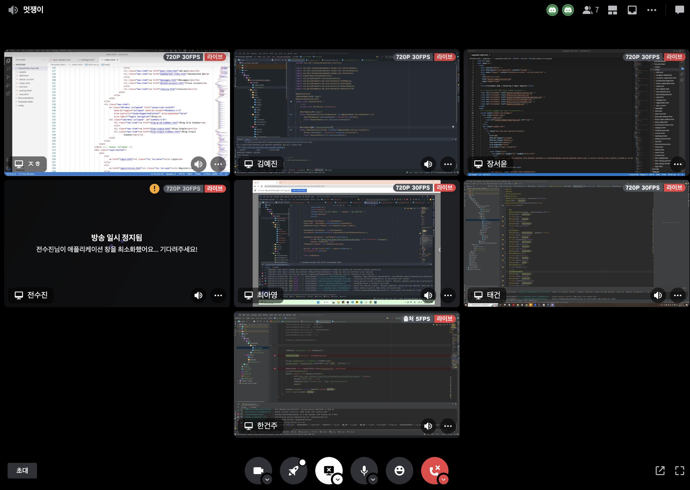

# 🥬 멋쟁이채소처럼
## 1주차 팀회고

## 🚀 팀 구성원, 개인 별 역할

---
아이디어톤 팀 구성원을 기재해 주시고,  
그 주의 팀원이 어떤 역할을 맡아서 개발을 진행했는지 구체적으로 작성해 주세요. 🙂

- 장서윤(PM/개발): 이슈생성, 프로젝트 관리, Merge Request 관리, 개별 기능 할당, Frontend
- 김예진(CTO/개발): 회원 가입 및 로그인, security
- 서태건(인프라/개발): 깃랩 CI/CD, 글 등록(농산물 경매)
- 전수진(기획/개발): 기업/농가 목록 조회
- 김정현(개발): Frontend
- 최아영(개발): 신청 ( 모집 등록 ) 본인인증
- 한건주(개발): 사업자 등록정보를 통한 기업 회원 검증

## 🗣️ 팀 내부 회의 진행 회차 및 일자

---
일주일 간 진행한 내부 회의 횟수와 일자, 진행 방법, 불참 인원을 위와 같이 작성해 주세요.

- 1회차) 2022.01.16 ~ 2022.01.17: 디스코드 라이브
    - ERD DB 설계
    - 스토리보드 작성(Oven)
- 2회차) 2022.01.18: 디스코드 라이브
    - Entity 모델링
    - 프로젝트 공통 패키지 구조 설계
    - 프로젝트 공통 디펜던시 논의 

## 🗒️ 현재까지 개발 과정 요약

---
현재까지 개발을 진행하면서 ‘기술적으로 새로 알게된 점, 어려웠던 점, 아쉬운 점' 등을 요약하여 작성해 주세요 🙂 
팀원 각자 현재 구현하고 있는 것을 작성해 주세요. :)

- 장서윤(PM/개발): 장서윤(PM/개발): ERD 설계 시 연관관계 매핑을 어떻게 해야 하는지 다수의 테이블을 생성하여 테이블을 Join 하는 것과 Join을 하는 경우 성능 문제가 생길 수 있기 때문에 테이블을 합쳐서 사용하는 방법을 택할 것인지에 대한 고민을 하면서 데이터베이스 성능 관련하여 공부하시는 시간을 가졌다. 협업 시 필요한 내부 convention을 정하면서 처음에 작은 것 하나까지 정해놓을수록 협업 시 팀원들이 혼동이 오지 않도록 원활한 소통이 가능하다는 것을 느꼈고 view를 담당하면서 각 기능별 동작 흐름을 한 번 더 짚어보는 시간이 됐다. 
- 김예진(CTO/개발): 회원 가입 과정에서 요청을 나눠보내는 아이디어를 구상하는데에 많은 고민을 했고, 구현하는 과정도 많은 시간이 필요할 것 같다. 그리고 추후 OAuth 2.0 을 이용해 간편 회원가입 및 로그인을 구현할 예정이라 OAuth 프로토콜과 Spring Security에 대해 더 공부가 필요할 것 같다.
- 서태건(인프라/개발): 무중단 배포를 하기 위해 준비하는 과정에서 ci/cd툴 travis, jenkins등 많은 툴 중에서 어떤 걸 선택할지와 배포를 위해 s3, nginx 등 새로운 툴과 동작 흐름을 찾아보면서 어려웠지만 조금이나마 전체적인 구조를 알게 되었고, 연관관계 맵핑이나 crud 할 때  미숙한 점이 많아 찾아보면서 하게 되어 속도가 느렸지만 많은 부분을 알게 되었다.
- 전수진(기획/개발): 기획을 맡으면서 도메인 공부를 많이 해야겠다는 생각이 들었다. 팀원들과 같이 회의를 하면서 erd 연관관계 등 팀 프로젝트에 대한 전반적인 진행 방식을 많이 배웠다. 기업, 농가 목록 조회 부분을 맡았는데 구현하는데 많은 어려움이 있어 이 부분은 더 찾아봐야 할 것 같다.
- 김정현(개발): 팀원들과 함께 기능을 개발하며 다양한 아이디어를 얻을 수 있었다. 이를 토대로 ERD를 설계하며 연관 관계에 대해 자세히 공부할 수 있었다. 스토리보드를 미리 구성해서 프론트엔드를 기획하는데 빠른 의사결정을 할 수 있었다. 프론트를 빠른 시일 내에 마무리하고 기능 구현을 하고 싶다.
- 최아영(개발): 네이버 클라우드 플랫폼 문자 발송 API를 사용해 인증번호 발송하는 것까지 구현하면서 OPEN API를 처음 써봐서 그런지 가이드를 봐도 어떻게 써야 될지 몰라서 어려웠다. 현재 별도 테이블을 만들어 인증 번호를 저장했는데 해당 방법은 매우 비효율적이라서 바꿔야겠다.
- 한건주(개발): 처음으로 API를 활용해서 프로젝트에 적용시켜보았다. 사업자 등록정보 확인 API를 사용하였고, 일반적인 GET Method API와는 달리 POST를 사용해서 해당 API에 JSON형식으로 Body를 넘겨줘야했다. 
  API를 호출하는 것 보다 JSONObject를 사용해 API가 원하는 형식으로 정보를 가공하는게 어려웠다. JSON을 Map 형태로 넘긴다는 걸 이해하고 LinkedHashMap을 사용해 문제를 해결했다.  여러 블로그에 나온 JSON 데이터를 가공하는 방법을 제대로 이해하지 않고 단순히 해결책만 찾으려고 해서 시간이 오래 걸린 것 같다. 기능 구현 과정이라 마음이 급하지만, 구현에 대한 원리를 자세하게 이해하고 해결 방법을 적용하는 것이 오히려 더 빠른 방법임을 알게 되었다.

## 개발 과정에서 나왔던 질문 (최소 200자 이상)

---

개발을 진행하며 나왔던 질문 중 핵심적인 것을 요약하여 작성해 주세요 🙂

- 질의응답 과정 중 해결되지 않은 질문을 정리하여도 좋습니다.
- 질문1
    - 상황 : 회원가입 할 때 ID를 이메일로 사용할 예정인데 회원가입 신청 요청을 보내기 전에 이메일 중복 여부를 확인하고 싶다.
    - 질문 : 회원 가입시 필요한 2번의 요청(이메일 중복 확인, 회원 가입)을 controller에서 endpoint를 2개로 나눠서 진행하려고 합니다. `/join/check` → `/join` 의 과정으로 회원 가입 요청 전에 이메일 중복을 체크할 예정인데 위의 아이디어로 구현하려면 어떻게 해야할 지 궁금합니다(view 화면은 동일한데 redirect로 구현해야 하는 것인지).🤔
- 질문2
    - 상황 : API에서 요구하는 Body를 전달할 때, 순서에 맞는 JSON 형식으로 전달해야한다.
    - 질문 :  Java에서 `JSONObject`를 사용할 경우, `JSONObject`는 HashMap 형식으로 데이터를 저장하기 때문에 순서가 매번 달라진다. 이 경우 `JSONObject`를 어떻게 정렬해야 할까.🤔
    - 해결 : `JSONObejct`에 저장할 때 두 가지 방법이 있다.
        1. `JSONObject`에 원하는 JSON 정보를 직접 `.put(map)` 한다.
        2. 먼저 `Map`을 만든다음 `JSONObject`에 `.put(map)` 한다.

      1번의 경우 GSON을 활용해서 정렬을 하라는 말이 있었지만, GSON이 데이터 처리를 다른 방식으로 하는지 JSON데이터 자체가 변경되었다. 그래서 2번 방법에서 `LinkedHashMap` 방법을 사용해 해결했다. Map에 저장할 때 저장하는 순서를 보존시키며 저장했고, `JSONObject`에 put 했다.😎

- 질문3
    - 상황: 이메일 인증 결과를 ResponseEntity body 안에 넣어서 전달할 예정입니다.
    - 질문 : 회원가입시 controller에서 ResponseEntity Json 형태로 Body 안에 값을 넣어 반환할 때 view에서 어떻게 처리하는지 궁금합니다.🤔

## 개발 결과물 공유

---

Gitlab Repository URL: [I5E2 멋쟁이채소처럼](https://gitlab.com/i5e2/like-awesome-vegetable/-/tree/main)

- 팀원들과 함께 찍은 인증샷 🙂 
다른 팀원은 어떻게 작업하고 있을까? 
멋쟁이채소처럼 디스코드 서버에 모여서 적극 소통을하며 라이브 코딩을 진행했습니다.🤣 

