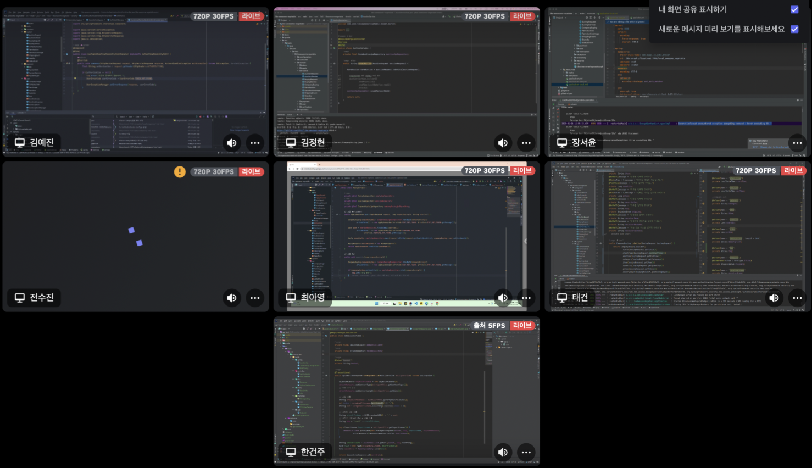
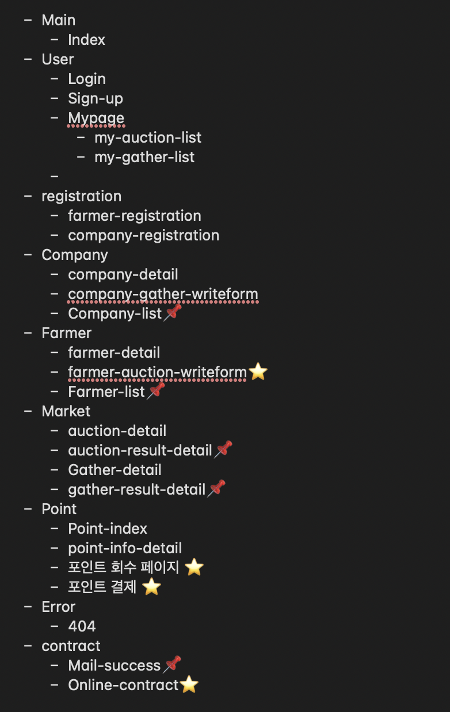

# 🥬 멋쟁이채소처럼

## 2주차 팀회고

## 🚀 팀 구성원, 개인 별 역할

아이디어톤 팀 구성원을 기재해 주시고, 
그 주의 팀원이 어떤 역할을 맡아서 개발을 진행했는지 구체적으로 작성해 주세요. 🙂

- 장서윤(PM/개발): frontend, 이슈, merge 관리
- 김예진(CTO/개발): spring security, oauth 2.0 회원가입/로그인 구현
- 서태건(인프라/개발): 모집 게시글 작성 + 유효성 검사
- 전수진(기획/개발):  기업/농가 리스트
- 김정현(개발): 프론트엔드, 경매 상세
- 최아영(개발): 모집/ 수량 및 조회 기능 구현
- 한건주(개발): 기업회원 검증 로직

## 🗣️ 팀 내부 회의 진행 회차 및 일자

일주일 간 진행한 내부 회의 횟수와 일자, 진행 방법, 불참 인원을 위와 같이 작성해 주세요.

- 1회차) 2022.01.25 디스코드 라이브
    - [프론트엔드 뷰 설명 및 페이지 할당](https://docs.google.com/presentation/d/1r4G6jzTn3J_QtFfZ5NC_oEgf0kLwH6yBJwPslcKgvz8/edit?usp=sharing)
- 2회차) 2022.01.26 디스코드 라이브
    - ERD DB 재설계
    - Entity 수정

## 🗒️ 현재까지 개발 과정 요약

현재까지 개발을 진행하면서 ‘기술적으로 새로 알게된 점, 어려웠던 점, 아쉬운 점' 등을 요약하여 작성해 주세요 🙂 
팀원 각자 현재 구현하고 있는 것을 작성해 주세요. :)

- 장서윤(PM/개발):
    - 새로 알게된 점 - 각 기능별로 정확히 어떤 데이터를 주고 받을 것인지 API를 문서화 시켜야 frontend와 backend가 원활한 소통이 가능하며 자신이 구현하는 기능 이외에도 도메인에 대한 이해가
      있어야 한다는 것을 느꼈다.
    - 어려웠던 점 - 프론트를 구현하는 과정에서 기능 명세가 정확하게 정해지지 않았었다.
      프론트를 구현하면서 테이블, view UI, 기능 정의를 동시에 확인하고 변경된 ERD와 entity를 자주 수정하는 과정에서 충돌이 나지 않도록 MR 관리를 하는것이 어려웠다
- 김예진(CTO/개발):
    - 새로 알게된 점 - oauth 2.0 의 구성 요소인 client와 resource server, resource owner 의 인증 절차를 공부했다. 각 구성 요소간의 주고받는 요청과 응답이 무엇인지
      공부했다.
    - 어려웠던 점 - oauth 2.0 의 동작 과정 속에서 주고받는 요청과 응답의 횟수가 많다. 그런데 각 과정에서 주고 받는 값도 달라지고 용어도 비슷한듯 다양해서 시퀀스 다이어그램을 함께 보면서
      이해하는데에 많은 시간을 썼다. 이론 상으로의 oauth 인증 과정을 이해하고 난 뒤에는 spring boot에서 어떻게 사용할 수 있는지 알아봐야 했다. spring 에서의 oauth의 관련 메소드.
      코드, 클래스들이 생소했고 추가로 security와 연결하는 것도 생각해야해서 너무 복잡했다. spring 에서 지원하는 oauth 관련 메소드나 클래스들이 생소해서 어떤 것을 찾아봐야하고 어떤것을
      적용해야 하는지 어렵다.
    - 아쉬운 점 - 예상했던 것보다 공부할 내용이 많아서 개발 일정이 밀린것이 아쉽다. 제대로 이해해서 구현을 해내겠다!
- 서태건(인프라/개발):
    - 새로 알게된 점 - 컨트롤러와 뷰 사이에서 model,modelattribute를 이용하면서 전반적인 구조에 대해서 알게 되었다.
    - 어려웠던 점 - 유효성 검증을 하면서 컨트롤러에서 뷰로 dto객체를 주고 받으면서 값을 넣고 전달하는 과정이 헷갈리면서 어려웠다.
    - 아쉬운 점 - 개발 속도가 느려서 기한 내에 기능 구현을 완성 하지 못한 게 아쉽다.
- 전수진(기획/개발):
    - 새로 알게된 점 - controller, service, repository 구조에 대해 생각하게 되었고 의존성 주입 방법을 알게되었다.
    - 어려웠던 점 - db 비밀번호를 초기화하는 과정이 어려웠는데 팀장님과 팀원들의 도움으로 무사히 해결되었다. 로직을 짜면서 무슨 값이 들어가고 리턴받는지가 어려워서 이 부분에 대한 이해도가 많이 필요할거
      같다.
    - 아쉬운 점 - spring boot의 전반적인 구조에 대해 이해도가 부족하여 기초를 많이 다져야겠다는 생각이 들었다.
- 김정현(개발):
    - 새로 알게된 점 - 타임리프 구조에 대해서 알게 되었다. ui/ux에 대해 더욱 자세히 공부할 수 있었다.
    - 어려웠던 점 - css 경로 지정을 하는데 어려움이 있었다. 절대 경로로 지정했음에도 적용이 되지 않아 조금 헤매었다. 로컬에서 돌려보니 잘 적용됨을 확인할 수 있었다.
- 최아영(개발):
    - 새로 알게된 점 - 인증번호를 관리하기 위해 Redis를 사용하면서 Spring Data Redis의 RedisRepository와 RedisTemplate 두 가지 방법에 대해 알게 되었다.
    - 어려웠던 점 - 모집이 완료되고 24시간 이내에 버튼을 클릭하지 않으면 자동으로 포인트가 배분 되게 해야 해서 Quartz 스케줄러에 대해 찾아보고 있지만 너무 어렵다.
    - 아쉬운 점 - ajax를 사용해 뷰를 갱신하고 싶었지만 잘 되지 않아서 아쉽다.
- 한건주(개발):
    - 새로 알게된 점
        - 이메일을 통한 기업 회원 검증에서 자바의 `JavaMailSender` 를 활용했다. 이메일 전송을 구현할 때 별도의 api를 사용하지 않고 자바 내부의 라이브러리를 통해서 구현할 수 있음을
          알게되었다. 또한 메일 전송에 있어서 **SMTP**와 **POP3**의 차이, **SSL**과 **TLS** 방식을 알게되었다.
        - AWS의 S3에 대해 알게되었다. S3의 특징과 S3내의 객체와 버킷의 차이를 알게되었다.
    - 어려웠던 점
        - 이메일 인증과 S3 적용 과정에서 내부 라이브러리 클래스의 역할과 코드의 흐름을 이해하기 어려웠다.
    - 아쉬운 점
        - 검증 로직에서 인증서나 핸드폰으로 본인 인증을 확실하게 구현하고 싶었는데 대부분의 인증 API는 유료라서 적용하지 못해 아쉽다.

## 📸 개발 결과물 공유

---

Gitlab Repository URL: [I5E2 멋쟁이채소처럼](https://gitlab.com/i5e2/like-awesome-vegetable/-/tree/main)

- 팀원들과 함께 찍은 인증샷 🙂 
  다른 팀원은 어떻게 작업하고 있을까? 
  멋쟁이채소처럼 디스코드 서버에 모여서 적극 소통을하며 라이브 코딩을 진행했습니다.🤣 
  

- 뷰 리스트 정리
  
